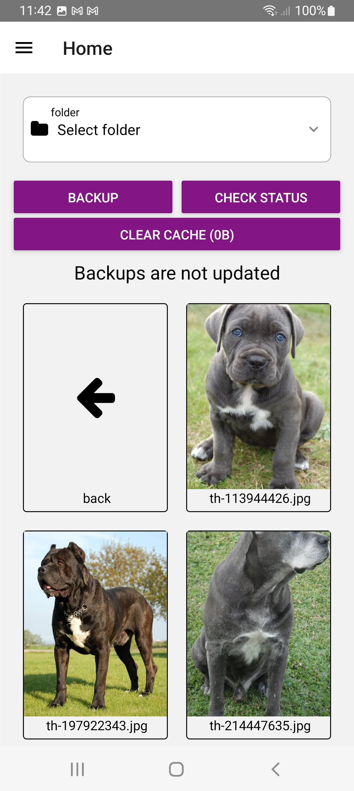

--- 

# Zippiri
Un'applicazione di backup Android progettata per semplificare il processo di protezione dei dati. Offre diverse opzioni di backup e compressione per adattarsi alle esigenze degli utenti.

--- 

## Caratteristiche Chiave

- Backup Differenziale, Incrementale e Completo.
- Compressione Zip, Gzip e Tar.
- Pianificazione automatica.
- Archiviazione su server privato.
- Pulizia della cache.
- Filtro connessione Wi-Fi e dati.
---
## Tipi di backup

- Incrementale
- Differenziale
- Completo
---
## Compressione

- Zip
- Gzip
- Tar
---
## Impostazioni server

- Indirizzo
- Signature
- Credenziali (username/password)
---
## Navigazione cartelle

---
## Struttura del progetto

- Views per pagine di settings e homepage.
- Components per elementi UI riutilizzabili.
- Lib per la logica interna dell'app
- Cartella Icons per le icone.
---
## Tecnologie utilizzate

- **React Native**
- **TypeScript**
- **Python**
- **Docker**
---
## Librerie
- **React Native File Access**
- **FontAwesome**
- **React Native WiFi Reborn e NetInfo**
- **React Native Modal**
- **React Native Async Storage**
- **React Native Document Picker**
- **React Native Zip Archive**
- **Base64**
---
# Grazie!